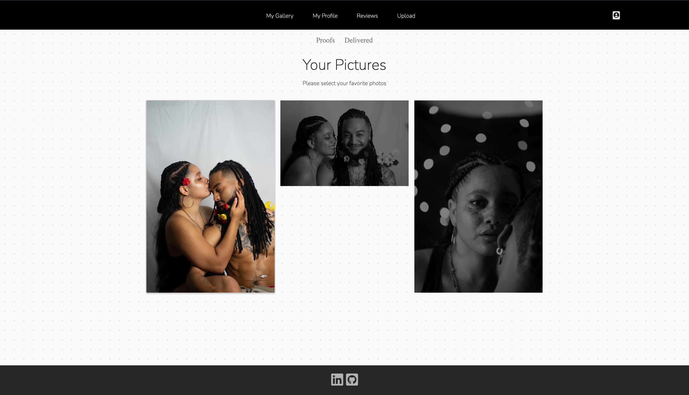
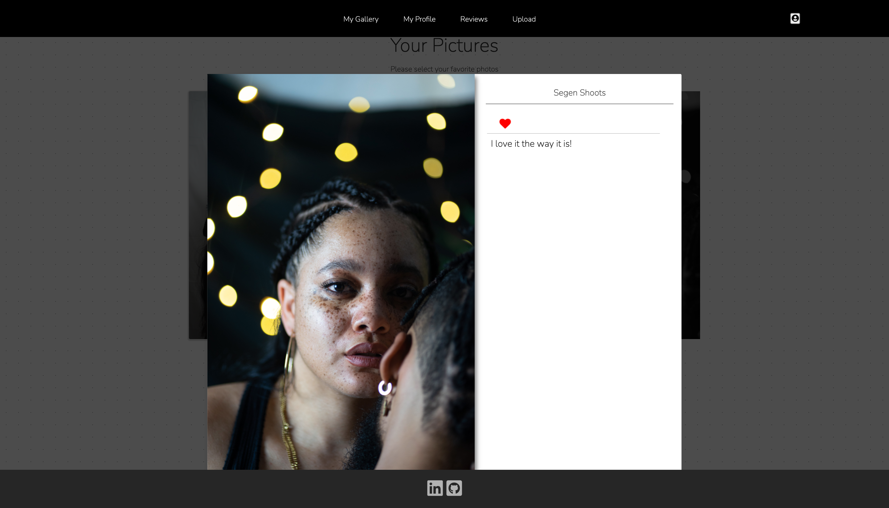
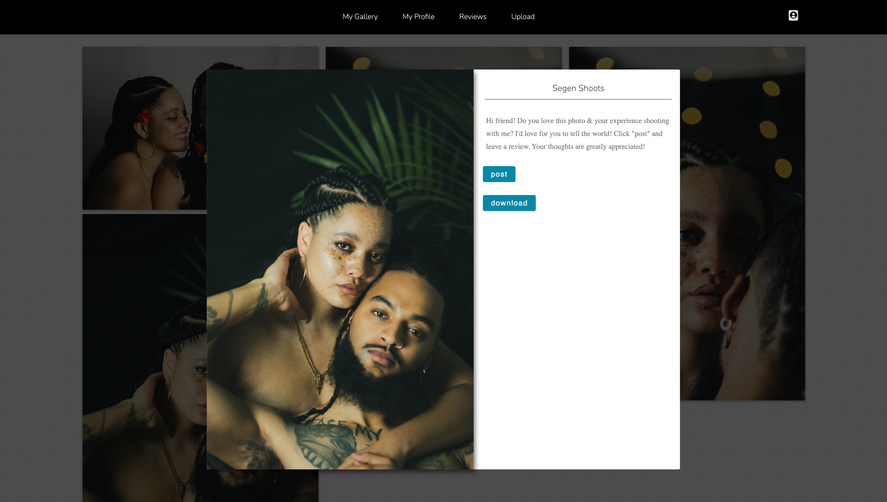
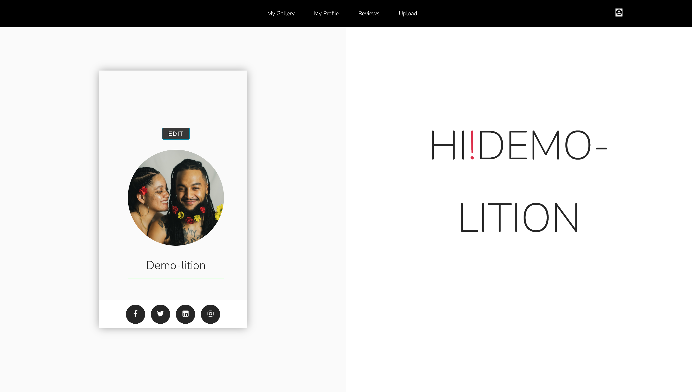

 

  
  
<h1 align="center"> Shoot </h1>

Shoot is designed for... Check it out [here](https://map-my-road-trip.herokuapp.com/login).

### Built With

#### Front End

#### Back End

#### Deployment and Package Management

### Features
<!-- #### Inviting splash page with the ability to see Trip Keeper's functionality in full prior to sign up with its demo login
 -->

#### Easy navigation available on each page with access to a feed of all client reviews, an editable profile page with social media links, and a complete photo album of pictures for you to choose from and comment on. 

#### Clients are able to choose their favorite photos from a photoshoot, shot by yours truly. They do this by liking the photo, which then changes the tone from black and white, to a color a image.

#### Clients are able to also comment on their favorite photos, requesting specific changes they would like to be made to the photo. Want to add a little fluff to your hair? So be it.

#### Clients can then download the photos once they're delivered, straight from the gallery! They can also pick their aboslute favorite photo leave a nice review for eveyone to see by posting it, without having to reupload the image.

#### Don't forget to edit your profile page! Just click edit profile and add an image along with your social media links.

